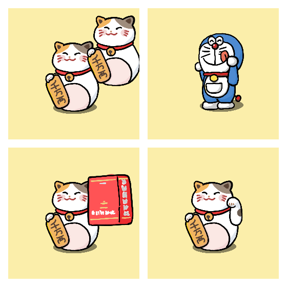

``` xml
<project name="Cat" width="256" height="256" x="40" y="15" fill="#fbeeaa" stroke="#3685aa">
    <project.bones>
        <bone name="shadow">
            <bone.joints>
                <joint name="shadow-j" halign="center" valign="middle" x="0" y="0" />
            </bone.joints>
            <bone.map from="shadow-j" to="body-j-shadow" />
            <bone.image src="assets/cat/cat-shadow.png" />
        </bone>

        <bone name="body">
            <bone.joints>
                <joint name="body-j" halign="end" valign="middle" x="10" y="10" />
                <joint name="body-j-shadow" halign="center" valign="bottom" x="5" y="10" />
            </bone.joints>
            <bone.map from="body-j" to="root" />
            <bone.image src="assets/cat/cat-body.png" />
        </bone>

        <bone name="hand">
            <bone.joints>
                <joint name="hand-j" halign="start" valign="bottom" x="15" y="10" />
            </bone.joints>
            <bone.map from="hand-j" to="body-j" />
            <bone.image src="assets/cat/cat-hand.png" />
        </bone>
    </project.bones>

    <project.animations>
        <animation name="main">
            <animation.frames>
                <frame name="f1">
                    <frame.setters>
                        <setter subject="bone" target="hand" name="angle" content="0" />
                    </frame.setters>
                </frame>

                <frame name="f2">
                    <frame.setters>
                        <setter subject="bone" target="hand" name="angle" content="-2" />
                    </frame.setters>
                </frame>

                <!-- ...... -->
            </animation.frames>
        </animation>
    </project.animations>
    <project.skins>
        <skin name="main">
            <skin.images>
            </skin.images>
        </skin>
        <skin name="han">
            <skin.images>
                <image target="hand" src="assets/bot/han.png" />
            </skin.images>
        </skin>
        <skin name="cat-cat">
            <skin.images>
                <image target="hand" src="assets/cat/cat-body.png" />
            </skin.images>
        </skin>
        <skin name="doraemon">
            <skin.images>
                <image target="body" src="assets/dora/dora-body.png" />
                <image target="hand" src="assets/dora/dora-hand.png" />
            </skin.images>
            <skin.setters>
                <setter subject="bone.joint" target="body-j" name="x" content="20" />
                <setter subject="bone.joint" target="body-j" name="y" content="20" />
            </skin.setters>
        </skin>
    </project.skins>
</project>
```